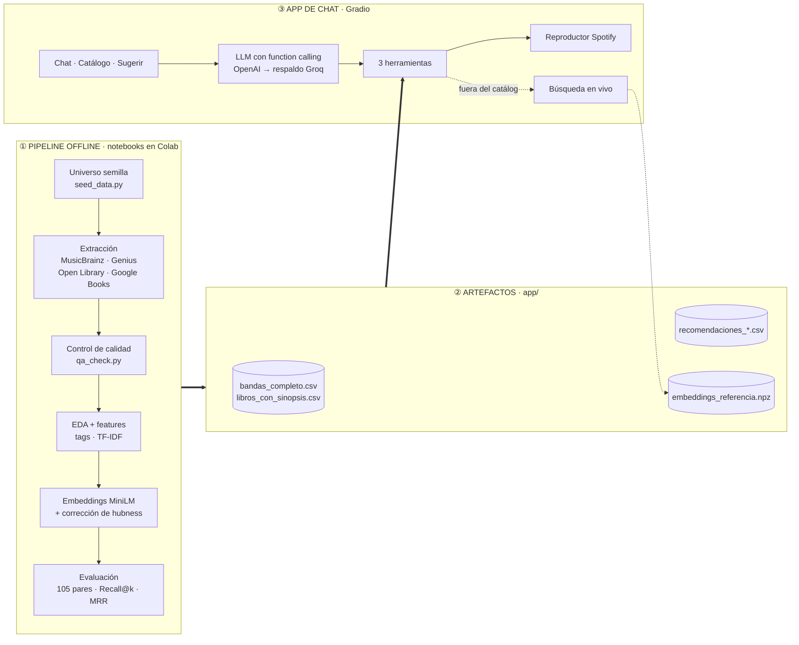
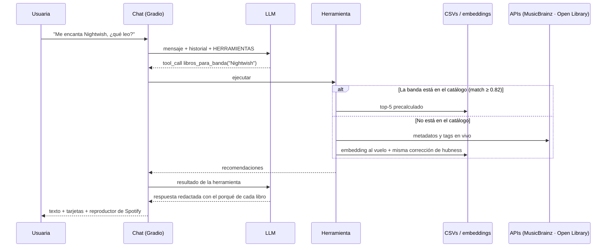

# 🎸📖 Inkriff

Plataforma de **recomendación bidireccional** entre música **rock/metal** y libros de **fantasía/romance**. Responde dos preguntas:

1. **Tengo una banda, ¿qué leo?** Libros con la misma atmósfera (oscura, épica, romántica, gótica…).
2. **Tengo un libro, ¿qué escucho?** Bandas que combinan con él, con su reproductor de Spotify embebido.

Todo pasa por un **chat conversacional** (LLM + *function calling*). Cada recomendación viene con una **explicación en lenguaje natural** de por qué encaja, nunca con un score solo.

La app tiene cuatro pestañas:

| Pestaña | Qué hace |
|---------|----------|
| **Inicio** | Portada con la descripción del proyecto |
| **Chat** | El recomendador conversacional, con reproductor de Spotify para las bandas y links de compra para los libros |
| **Catálogo** | Top 50 bandas (por popularidad en Genius) y top 50 libros (por cuántas bandas del catálogo los recomiendan), con sinopsis, con qué combinan y dónde escucharlos o comprarlos |
| **Sugerir** | Formulario sin cuenta para proponer una banda o un libro nuevo para el catálogo |

> ⚠️ **Inkriff es un proyecto académico**: presentado como una empresa ficticia de IA, y **no es un producto comercial**. No reproduce ni redistribuye letras de canciones ni texto de libros; solo usa metadatos, tags y sinopsis públicas.

---

## Índice

- [Arquitectura](#arquitectura)
- [Componentes](#componentes)
- [Resultados del modelo](#resultados-del-modelo)
- [Requisitos previos](#requisitos-previos)
- [Puesta en marcha](#puesta-en-marcha)
  - [Opción A: Local (make)](#opción-a-local-make)
  - [Opción B: Hugging Face Spaces (automático desde GitHub)](#opción-b-hugging-face-spaces-automático-desde-github)
  - [Opción C: Google Colab (notebooks)](#opción-c-google-colab-notebooks)
- [Configuración de entorno (.env)](#configuración-de-entorno-env)
- [Herramientas del chat](#herramientas-del-chat)
- [Estructura del repositorio](#estructura-del-repositorio)
- [Datos y fuentes](#datos-y-fuentes)
- [Alcance y limitaciones](#alcance-y-limitaciones)
- [Solución de problemas](#solución-de-problemas)

---

## Arquitectura

El proyecto tiene dos partes: un **pipeline offline** de notebooks, que se corre una vez en Colab, y una **app de chat** en Gradio que consume lo que ese pipeline genera. La app no reentrena nada: usa las recomendaciones precalculadas para el catálogo y solo calcula en vivo cuando le preguntas por una banda o un libro que no están en él.



### Flujo de una recomendación



---

## Componentes

### Pipeline: notebooks (`notebooks/`)

Se corren **en este orden**. Cada notebook lee los CSVs que dejó el anterior.

| # | Notebook | Qué hace | Produce |
|---|----------|----------|---------|
| 1 | `inkriff_pilot_extraccion.ipynb` | Piloto: valida las APIs con 1 ítem por categoría | `piloto_*.csv` |
| 2 | `inkriff_extraccion_completa.ipynb` | Extracción del universo completo (81 bandas, 112 libros) con reintento y *backoff* | `bandas_musicbrainz.csv`, `metadatos_genius.csv`, `libros.csv`, `bandas_completo.csv` |
| 3 | `inkriff_eda_ingenieria.ipynb` | EDA (Zipf, tags, cobertura), extracción de sinopsis e ingeniería de variables | `libros_con_sinopsis.csv`, `*_features.csv` |
| 4 | `inkriff_modelado_similitud.ipynb` | Compara TF-IDF, embeddings y embeddings con corrección de hubness, evalúa contra los 105 pares y elige el mejor por MRR | `recomendaciones_*.csv`, `embeddings_referencia.npz` |
| 5 | `inkriff_chat_recomendador.ipynb` | La app de chat en Colab (`share=True`) | — |
| — | `inkriff_pipeline_recomendador.ipynb` | Versión 1 de la interfaz, con *dropdowns* y sin chat (histórico) | — |

### App de chat (`app/`)

| Componente | Responsabilidad |
|------------|-----------------|
| Proveedor LLM | OpenAI (`gpt-4o-mini`) como principal y Groq (`openai/gpt-oss-20b`) como **respaldo automático** si falla o se agota la cuota |
| `HERRAMIENTAS` | 3 funciones separadas, una por tipo de resultado, para que el LLM no confunda "mencionó una banda" con "el resultado son bandas" |
| Catálogo | *Fuzzy match* (`SequenceMatcher` ≥ 0.82) contra 81 bandas y 112 libros, con respuesta instantánea |
| Búsqueda en vivo | MusicBrainz / Open Library / Google Books con reintento exponencial; embedding al vuelo con el **mismo** modelo y la **misma** corrección de hubness |
| Spotify | Reproductor embebido: se reescribe el link público a `/embed/`, sin API key |
| Links de compra | Búsqueda del libro en Amazon México, Gandhi, El Sótano, Sanborns y Porrúa. Son links de **búsqueda**, no del producto exacto (no hay ISBN por tienda) |
| Catálogo Top 50 | HTML precalculado al arrancar. La popularidad de libros es interna (frecuencia de recomendación); no hay un dato externo de popularidad |
| Sugerencias | Se guardan en `sugerencias_usuarios.csv` y, si hay Dataset configurado, también en un Dataset **privado** de Hugging Face (sobrevive a reinicios del Space) |

### Scripts (`scripts/`)

| Script | Rol |
|--------|-----|
| `seed_data.py` | Universo semilla: 24 subgéneros de bandas y 15 categorías de libros, curado a mano |
| `build_notebook*.py`, `build_chat_app.py`, `build_pipeline.py` | **Generadores**: producen los notebooks y `app.py`. Los notebooks no se editan a mano |
| `build_pares_final.py` | Reconstruye en UTF-8 limpio los 105 pares curados (el CSV original llegó con la codificación dañada desde Excel) |
| `qa_check.py` | Marca los *matches* dudosos de Genius y Open Library (similitud de cadena) |
| `rebuild_features_v2.py` | Limpieza mejorada de sinopsis (URLs, ISBN, "ruido editorial") |
| `test_musicbrainz.py` | Prototipo de conexión a MusicBrainz |

**Decisiones clave** (el detalle completo está en [`AGENTS.md`](AGENTS.md)):

- **D1**: Similitud de contenido en vez de entrenar una red. Con 105 pares no alcanza para separar entrenamiento y validación sin memorizar.
- **D2**: Los 105 pares curados se usan **solo para evaluar**, nunca para entrenar.
- **D3**: Corrección de *hubness* por centrado, para que unos pocos libros no dominen todas las recomendaciones.
- **D4**: No se usan letras de canciones (ToS de Genius y bloqueo por Cloudflare). El *mood* musical sale de los tags de MusicBrainz.
- **D5**: Gradio en un solo proceso, sin backend/frontend separados, porque todo tiene que caber en *free tier*.

---

## Resultados del modelo

Evaluado contra los **105 pares libro↔banda curados a mano**. Para cada par se mide en qué posición queda el elemento correcto al ordenar todos los candidatos del otro lado.

| Métrica | TF-IDF (baseline) | Embeddings | **Embeddings + hubness** |
|---------|:-:|:-:|:-:|
| Rank promedio banda (azar 40.5) | 44.4 | 37.5 | **34.6** |
| Recall@5 banda | 5.7% | 6.7% | **10.5%** |
| Recall@10 banda | 13.3% | 17.1% | **18.1%** |
| MRR banda | 0.064 | 0.065 | **0.083** |
| Rank promedio libro (azar 56.0) | 54.5 | 46.2 | **45.9** |
| Recall@10 libro | 12.4% | 13.3% | **15.2%** |
| MRR libro | 0.065 | 0.069 | **0.077** |

**Efecto de la corrección de hubness:** el libro top-1 más repetido pasó de aparecer en **38.3%** de las bandas a **7.4%**.

| Consulta | Top-5 recomendado |
|----------|-------------------|
| 📖 *El Señor de los Anillos* | Sabaton, Jinjer, DragonForce, Avenged Sevenfold, Judas Priest |
| 🎸 Chelsea Wolfe (gothic metal) | El castillo de Otranto, Carmilla, Drácula, El retrato de Dorian Gray, El vampiro Lestat |
| 🎸 Emperor (black metal) | Babel, Berserk, El circo de la noche, La compañía negra, Frankenstein |

Metodología completa en [`docs/Inkriff_Metodologia_y_Resultados.docx`](docs/Inkriff_Metodologia_y_Resultados.docx).

---

## Requisitos previos

| Herramienta | Versión | Verificación |
|-------------|---------|--------------|
| Python | 3.10+ | `python --version` |
| pip | viene con Python | `pip --version` |
| make (opcional) | cualquiera | `make --version` |
| Cuenta de Google | para Colab (opción C) | — |
| API key de OpenAI **o** Groq | al menos una | [platform.openai.com](https://platform.openai.com/api-keys) · [console.groq.com](https://console.groq.com/keys) (gratis) |

> 💡 En Windows sin `make`, cada comando equivalente está en la [opción A](#opción-a-local-make).

---

## Puesta en marcha

> El único servicio imprescindible es **un LLM** (OpenAI o Groq). Sin API key, la app arranca pero el chat te pide que configures una.

### Opción A: Local (make)

1. **Configura el entorno**
   ```bash
   cp .env.example .env
   # edita .env y pon OPENAI_API_KEY y/o GROQ_API_KEY
   ```
2. **Instala dependencias**
   ```bash
   make setup          # = pip install -r requirements.txt
   ```
3. **Arranca el chat**
   ```bash
   make run            # = cd app && python app.py
   ```
   UI → <http://localhost:7860>

Sin `make` (Windows / PowerShell):
```powershell
pip install -r requirements.txt
$env:OPENAI_API_KEY="tu-api-key"
cd app; python app.py
```

### Opción B: Hugging Face Spaces (automático desde GitHub)

La app se publica **gratis** en un Space de Hugging Face (CPU basic: 2 vCPU, 16 GB RAM, suficiente para este proyecto). Dos *workflows* de GitHub Actions lo hacen solos:

| Workflow | Cuándo corre | Qué hace |
|----------|--------------|----------|
| `Regenerar modelo` (`modelo.yml`) | Cuando cambian los datos de entrada o el script de modelado, o a mano | Ejecuta el notebook 4 en los servidores de GitHub, verifica que los embeddings tengan 384 dims y hace commit de `recomendaciones_*.csv`, `.npz` y el notebook con resultados |
| `Desplegar en Hugging Face` (`deploy-hf.yml`) | Cuando cambia `app/` o termina `Regenerar modelo` | Crea el Space si no existe, guarda las API keys como *secrets*, crea el Dataset privado `inkriff-sugerencias` y sube `app/` |

**Configuración (una sola vez)**, en GitHub → *Settings → Secrets and variables → Actions → New repository secret*:

| Secret | Obligatorio | De dónde sale |
|--------|:-:|---------------|
| `HF_TOKEN` | ✅ | [huggingface.co/settings/tokens](https://huggingface.co/settings/tokens) → *Create new token* → tipo **Write** |
| `OPENAI_API_KEY` | uno de los dos | [platform.openai.com/api-keys](https://platform.openai.com/api-keys) |
| `GROQ_API_KEY` | uno de los dos | [console.groq.com/keys](https://console.groq.com/keys) (gratis) |

El Space queda en `https://huggingface.co/spaces/<tu-usuario-hf>/inkriff`. Para usar otro nombre, crea la *variable* (no secret) `HF_SPACE` con el valor `usuario/nombre`.

Despliegue manual sin Actions: `HF_TOKEN=hf_xxx python scripts/deploy_hf.py`.

### Opción C: Google Colab (notebooks)

Para reproducir el pipeline completo desde cero:

1. Abre los notebooks de `notebooks/` en Colab, **en el orden de la tabla de [Componentes](#pipeline-notebooks-notebooks)**.
2. En cada uno, sube a la sesión los CSVs que lee con `pd.read_csv` (están en `data/raw/` y `data/processed/`). Los notebooks los buscan en la carpeta actual.
3. El notebook 4 descarga el modelo `paraphrase-multilingual-MiniLM-L12-v2`. **No hace falta correrlo en Colab**: el workflow `Regenerar modelo` lo ejecuta en GitHub (pestaña *Actions → Regenerar modelo → Run workflow*).

---

## Configuración de entorno (.env)

Copia `.env.example` a `.env`.

| Variable | Default | Notas |
|----------|---------|-------|
| `OPENAI_API_KEY` | — | Proveedor principal |
| `GROQ_API_KEY` | — | Respaldo gratuito; se usa solo si OpenAI falla |
| `INKRIFF_LLM_PROVEEDOR` | `openai` | Pon `groq` para usar solo la opción gratuita |
| `INKRIFF_LLM_MODELO_OPENAI` | `gpt-4o-mini` | |
| `INKRIFF_LLM_MODELO_GROQ` | `openai/gpt-oss-20b` | |
| `INKRIFF_DATASET_ID` | — | Dataset de HF para guardar sugerencias (`usuario/inkriff-sugerencias`); lo configura solo el despliegue |
| `HF_TOKEN` | — | Solo para escribir en ese Dataset |

> 🔒 `.env` está en `.gitignore`. **Nunca subas API keys al repositorio.**

---

## Herramientas del chat

El LLM decide qué herramienta llamar según lo que escribas y puede encadenar varias en una misma respuesta.

| Herramienta | Entrada | Devuelve | Alcance |
|-------------|---------|----------|---------|
| `libros_para_banda` | nombre de banda | top-5 libros + categoría + similitud | Cualquier banda (catálogo o en vivo) |
| `bandas_para_libro` | título de libro | top-5 bandas + subgénero + similitud | Cualquier libro (catálogo o en vivo) |
| `canciones_de_banda` | nombre de banda | reproductor de Spotify | Solo bandas del catálogo (las únicas con link guardado) |

Ejemplos de mensajes:
```text
Me gusta mucho Nightwish, ¿qué libro me recomiendas?
Acabo de terminar Una corte de rosas y espinas, ¿qué banda le queda?
Ponme algo de la primera banda que me dijiste
```

---

## Estructura del repositorio

```
Inkriff/
├── README.md                 # este archivo
├── AGENTS.md                 # decisiones, convenciones y trampas verificadas
├── Makefile                  # setup, run, notebooks, app, sync-app, clean
├── requirements.txt          # dependencias para notebooks + app
├── .env.example              # plantilla de configuración (copiar a .env)
├── .github/workflows/        # modelo.yml (regenera el modelo) · deploy-hf.yml (publica en HF)
├── app/                      # ✅ app de chat lista para desplegar
│   ├── README.md             #    configuración del Space de Hugging Face
│   ├── app.py                #    generado por scripts/build_chat_app.py
│   ├── requirements.txt
│   ├── embeddings_referencia.npz
│   └── *.csv                 #    catálogo + recomendaciones que consume el chat
├── notebooks/                # pipeline completo (ver tabla de Componentes)
├── data/
│   ├── raw/                  # salida directa de las APIs + control de calidad (*_qa.csv)
│   └── processed/            # features, pares curados, recomendaciones, embeddings
├── scripts/                  # generadores de notebooks/app, universo semilla, QA
├── legacy/
│   └── app_dropdown_v1/      # primera interfaz (dropdowns, sin chat)
└── docs/
    ├── Inkriff_canvas_original.pdf
    ├── Inkriff_Metodologia_y_Resultados.docx
    └── Inkriff_Prompt_Arranque.md
```

### Diccionario de datos

| Archivo | Forma | Contenido |
|---------|-------|-----------|
| `raw/bandas_completo.csv` | 81 × 10 | Banda, subgénero, MBID, país, tags, link de Spotify, canción top y *pageviews* de Genius |
| `raw/libros.csv` | 112 × 6 | Título buscado, categoría, título encontrado, autor, año y fuente |
| `raw/*_qa.csv` | — | Lo mismo más `similitud_*` y la bandera `revisar` |
| `processed/libros_con_sinopsis.csv` | 112 × 10 | Libros con sinopsis (97 de 112 la tienen) |
| `processed/bandas_features.csv` | 81 × 58 | One-hot de subgénero + multi-hot de los 30 tags más frecuentes |
| `processed/libros_features.csv` | 112 × 318 | One-hot de categoría + TF-IDF (300 términos) |
| `processed/pares_semilla_final.csv` | 105 × 4 | **Pares curados a mano** (libro, categoría, banda, razón) |
| `processed/pares_features.csv` | 105 × 385 | Pares unidos con las features de ambos lados |
| `processed/recomendaciones_*.csv` | 405 / 560 | Top-5 por banda y top-5 por libro |

---

## Datos y fuentes

| Fuente | Uso | Reglas |
|--------|-----|--------|
| [MusicBrainz](https://musicbrainz.org/doc/MusicBrainz_API) | Metadatos, tags de género y link de Spotify | User-Agent propio, **≤ 1 req/s**, reintento ante 503 |
| [Genius API](https://docs.genius.com/) | Solo metadatos (canción top, *pageviews*) | **Sin letras** (ToS, y el scraping está bloqueado por Cloudflare) |
| [Open Library](https://openlibrary.org/developers/api) | Ficha bibliográfica y sinopsis | Reintento ante 429 |
| [Google Books](https://developers.google.com/books) | Respaldo de Open Library | — |
| Spotify | Solo el reproductor embebido | Los endpoints de *audio features* están deprecados desde nov. 2024 y no se usan |

**Control de calidad:** 10 de 81 bandas (12.3%) tuvieron un *match* de Genius incorrecto (por ejemplo, "Death" devolvió Arctic Monkeys). Quedan marcadas y su popularidad no se usa como señal.

---

## Alcance y limitaciones

- Recomienda **entre** dominios (banda → libro, libro → banda), no dentro del mismo.
- Solo hay 105 pares de evaluación, así que las métricas son una estimación, no un número exacto.
- 15 de 112 libros no tienen sinopsis; se excluyen como candidatos para no degradar las recomendaciones.
- El vocabulario musical y la prosa narrativa son dominios semánticamente lejanos: el modelo supera al azar, pero todavía está lejos de un sistema ideal.
- La corrección de hubness es un centrado simple (en el espíritu de CSLS), no el estado del arte.

---

## Solución de problemas

| Síntoma | Causa | Solución |
|---------|-------|----------|
| El chat responde "no tengo configurada ninguna API key" | Faltan `OPENAI_API_KEY` y `GROQ_API_KEY` | Define al menos una en `.env` o en los *secrets* del Space |
| `RateLimitError` / cuota agotada de OpenAI | Crédito agotado | La app cambia sola a Groq si hay `GROQ_API_KEY`; o usa `INKRIFF_LLM_PROVEEDOR=groq` |
| Groq devuelve `400 Tool choice is none` | Faltaban las herramientas en la última ronda | Ya corregido: `tools` va en todas las rondas (ver `generar_respuesta_completa`) |
| `FileNotFoundError: *.csv` | La app no encuentra sus datos | Ejecuta la app **desde `app/`**, o corre `make sync-app` |
| Error de dimensiones al buscar un ítem fuera del catálogo | `embeddings_referencia.npz` no viene del modelo MiniLM (384 dims) | Corre *Actions → Regenerar modelo*; el workflow verifica las 384 dims |
| El workflow de despliegue termina con el aviso "Falta el secret HF_TOKEN" | No se ha configurado el token | Agrega `HF_TOKEN` en los secrets del repo y vuelve a correrlo |
| El Space dice *Building* varios minutos | La primera vez instala torch y descarga el modelo | Es normal (~5-10 min); después arranca rápido |
| El Space dice *Runtime error* por falta de API key | No se pasaron `OPENAI_API_KEY` / `GROQ_API_KEY` | Agrégalas como secrets en GitHub y vuelve a correr el despliegue |
| MusicBrainz devuelve 503 | Límite de ~1 req/s | Ya hay reintento con *backoff* exponencial; espera y reintenta |
| CSV con acentos rotos (`�`) | Exportado desde Excel sin elegir "CSV UTF-8" | Guarda como **CSV UTF-8**; ver `scripts/build_pares_final.py` |

---

Decisiones completas, convenciones y trampas verificadas: [`AGENTS.md`](AGENTS.md).
